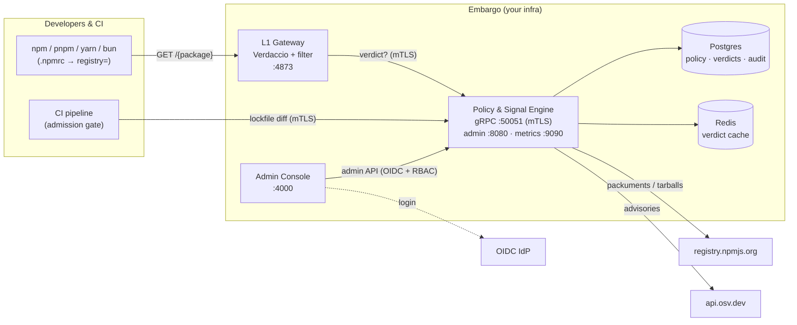
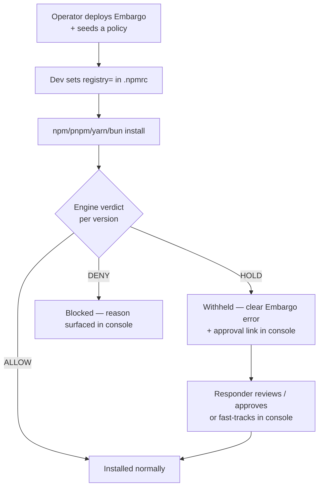

# Deployment

How to stand Embargo up for a team or organization. This is the **operations**
guide; for running components on a laptop while hacking on them see
[`DEVELOPMENT.md`](DEVELOPMENT.md), and for the design see
[`ARCHITECTURE.md`](ARCHITECTURE.md).

Embargo is **single-org, self-hosted**. You run it inside your own
infrastructure, in front of your own clients and CI — nothing leaves your
network except the engine's outbound calls to the upstream npm registry and the
OSV advisory feed.

## Topology



The **engine is the only stateful brain**; the gateway and console are
stateless and scale horizontally behind a load balancer. All
component-to-engine traffic on `:50051` is **mutual TLS** — the engine
authenticates each caller by client certificate.

## What ships in this repo

| Path | Deployment artifact |
|---|---|
| [`docker-compose.yml`](docker-compose.yml) | Full stack: postgres + redis + certgen + engine + console + gateway |
| [`engine/Dockerfile`](engine/Dockerfile) | Engine image (`:50051` gRPC, `:8080` admin, `:9090` metrics) |
| [`gateway/Dockerfile`](gateway/Dockerfile) | Verdaccio + Embargo filter (`:4873`) |
| [`console/Dockerfile`](console/Dockerfile) | Static console behind nginx (`:4000`) |
| [`scripts/gen-dev-certs.sh`](scripts/gen-dev-certs.sh) | Dev CA + server/client mTLS chain |
| [`admission/action.yml`](admission/action.yml) | L2 CI gate as a GitHub Action |

> **Not yet in-repo:** a published Helm chart and a hardened, pinned-image
> production compose file are tracked follow-ups (see [`docs/STATUS.md`](docs/STATUS.md)).
> The Kubernetes section below describes the **target topology** to translate the
> compose services into manifests; it is guidance, not shipped YAML.

## Quick deploy — Docker Compose

The fastest real deployment. On the host that will run Embargo:

```bash
git clone <your-fork> embargo && cd embargo
make up                       # build + start, wait for health, print next steps
# (equivalently: docker compose up --build -d)

# console      → http://<host>:4000
# gateway      → http://<host>:4873   (clients point registry= here)
# admin API    → http://<host>:8080/api
# engine health→ http://<host>:9090/health/ready
```

`make up` runs [`scripts/quickstart.sh`](scripts/quickstart.sh), which waits for
the engine's readiness probe and prints the client-onboarding snippet. Set
`EMBARGO_HOST=<dns>` to advertise a non-local hostname in that output.

Out of the box compose runs in **dev auth** (role picker) with a **dev CA**.
That is fine for an internal trial, **not** for production — see hardening
below.

## Production hardening checklist

The compose file is a working topology; production swaps four things — **real
PKI, OIDC auth, a fail-closed gate, and managed datastores**.

### 1. Bring your own PKI (mTLS)

`scripts/gen-dev-certs.sh` issues a throwaway CA. In production, issue the chain
from your own CA / cert-manager / Vault PKI. You need:

- **engine** — a *server* cert (EKU `serverAuth`) whose SAN matches the DNS name
  the gateway/admission/sandbox dial (e.g. `DNS:engine.embargo.svc`).
- **gateway, admission, sandbox** — *client* certs (EKU `clientAuth`) signed by
  the same CA the engine trusts.

Wire them into the engine via `EMBARGO__TLS__CERT_PEM` / `__KEY_PEM` / `__CA_PEM`
and into the gateway via the filter's `tls-cert` / `tls-key` / `tls-ca`. Rotate
on your normal cadence; the engine reads them at startup.

### 2. Switch auth to OIDC

Dev auth trusts headers — never expose it. Point both sides at your IdP:

```bash
# engine
EMBARGO__AUTH__MODE=oidc
EMBARGO__AUTH__ISSUER=https://idp.example.com/
EMBARGO__AUTH__AUDIENCE=embargo
EMBARGO__AUTH__JWKS_URL=https://idp.example.com/.well-known/jwks.json
```

Build the console with `VITE_AUTH_MODE=oidc` and `VITE_OIDC_AUTHORITY` /
`VITE_OIDC_CLIENT_ID` / `VITE_OIDC_SCOPE`. RBAC is enforced **server-side**;
roles map from your IdP groups. (Full auth reference: [`DEVELOPMENT.md`](DEVELOPMENT.md#admin-facade--auth).)

The role mapping defaults to the IdP groups `embargo-admin` and
`embargo-responder`. To map different group names, set `auth.admin_roles` /
`auth.responder_roles` as **arrays in a `config/engine.yaml`** file — list values
are not supported through `EMBARGO__*` env vars:

```yaml
# config/engine.yaml
auth:
  admin_roles: ["platform-admins"]
  responder_roles: ["secops"]
```

### 3. Close the gate (`fail-closed`)

The gateway filter defaults to **fail-open** — if the engine is unreachable it
serves packuments unfiltered, prioritizing availability. For a security gate you
almost certainly want the opposite: set `fail-closed: true` in the filter config
so the gateway **refuses to serve** when it cannot get a verdict. Decide this
deliberately — it trades availability for enforcement.

### 4. Managed, highly-available datastores

- **Postgres** — holds policy, verdicts, approvals, and the tamper-evident audit
  log. Use a managed instance or primary+replica with failover; take regular
  backups + PITR. Migrations run automatically at engine startup.
- **Redis** — verdict cache only (loss is non-fatal; it just re-resolves). Use
  Sentinel/cluster if you want the cache to survive a node loss.

### 5. Seed a real policy

Compose self-seeds [`policy/examples/default.yaml`](policy/examples/default.yaml)
on first boot via `EMBARGO__BOOTSTRAP_POLICY_PATH`. Replace it with your own —
start from [`policy/examples/strict.yaml`](policy/examples/strict.yaml) — and
manage it thereafter through the console (it is version-controlled in Postgres
with an audit trail).

### 6. Observability

The engine exposes Prometheus metrics and health on `:9090`
(`/metrics`, `/health/live`, `/health/ready`) and emits OpenTelemetry traces
when `EMBARGO__OBSERVABILITY__OTLP_ENDPOINT` is set. Run with
`EMBARGO__OBSERVABILITY__LOG_FORMAT=json` in production and ship structured logs.

### Ports & egress

| Component | Port | Exposure |
|---|---|---|
| Gateway | `4873` | internal to clients/CI |
| Console | `4000` | internal to operators |
| Engine — admin HTTP | `8080` | console only |
| Engine — gRPC (mTLS) | `50051` | gateway / admission / sandbox only |
| Engine — metrics/health | `9090` | scrapers / orchestrator probes |

Required **outbound** from the engine: the upstream registry
(`upstream_registry`, default `registry.npmjs.org`) and the OSV feed
(`osv_endpoint`, default `api.osv.dev`). Everything else stays inside your
network.

## Onboarding clients

Once the gateway is reachable, a client opts in with **one line**:

```ini
# .npmrc  (repo-local or ~/.npmrc)
registry=https://embargo.your-org.internal/
```



Add the **L2 admission gate** to CI so the same policy fails builds that
introduce a held/denied version (see [`admission/README.md`](admission/README.md)),
and optionally run installs under the **L3 sandbox** for egress containment.

## Kubernetes (target topology)

No chart ships yet, but the compose services map cleanly to Kubernetes:

- **engine** — `Deployment` (2+ replicas, stateless), `Service` on
  `50051/8080/9090`. mTLS certs from a cert-manager `Certificate` mounted as a
  `Secret`; DB/Redis URLs and OIDC config from `Secret`/`ConfigMap`. Wire
  `/health/live` and `/health/ready` to liveness/readiness probes.
- **gateway** — `Deployment` + `Service` on `4873` behind your ingress; mounts
  the client cert + CA; `fail-closed: true`.
- **console** — `Deployment` + `Service` on `4000` behind ingress (OIDC build).
- **postgres / redis** — managed services or in-cluster operators; never the
  ephemeral compose containers.

Until the chart lands, generate manifests from the Dockerfiles + the env tables
above (and in `DEVELOPMENT.md`).

## Upgrades

1. Pull/build the new images.
2. Roll the **engine** first — schema migrations run automatically at startup;
   take a Postgres backup beforehand.
3. Roll the gateway and console. Both are stateless, so a rolling restart has no
   data implications.

## Verifying a deployment

```bash
# engine is up and migrated
curl -fsS http://<host>:9090/health/ready

# gateway serves a firewalled packument (held/denied versions stripped)
npm view <package> --registry http://<host>:4873/

# console reachable; sign in and confirm the seeded policy + dashboard render
open http://<host>:4000
```

A green `/health/ready`, a filtered packument, and a console that lists your
policy mean the L1 path is live end-to-end.
</content>
