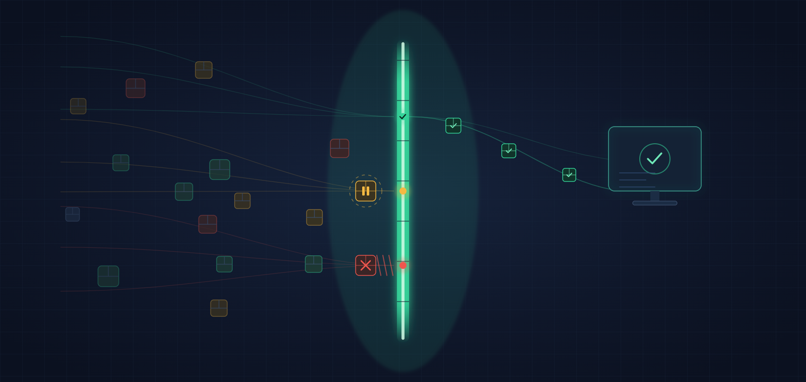
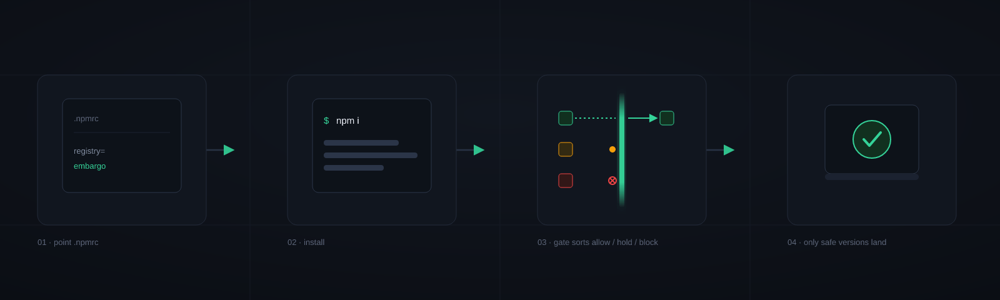
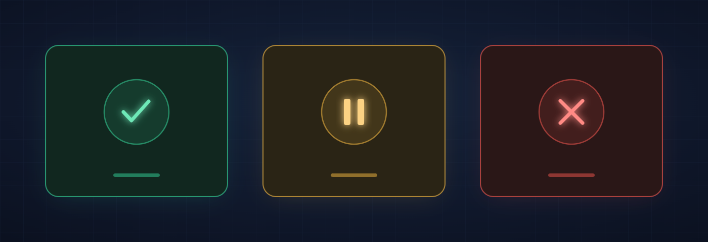
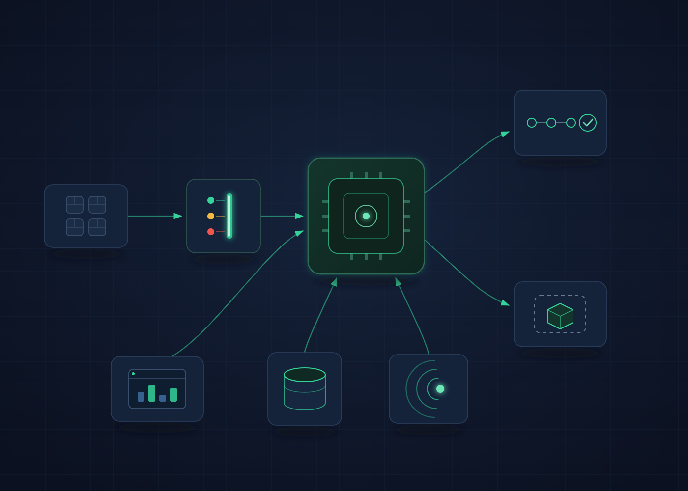
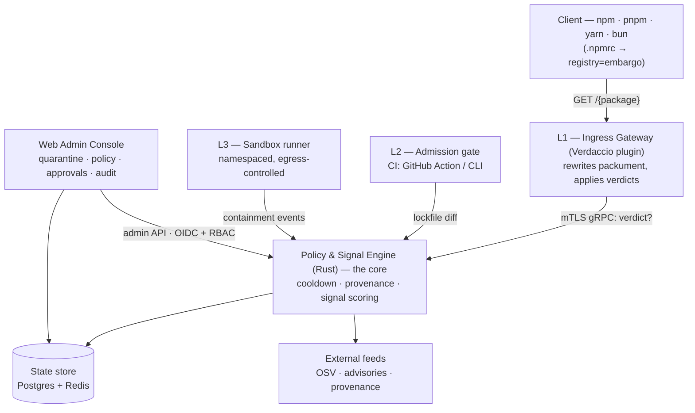

# Embargo

<p align="center">
  
</p>

**A self-hosted dependency firewall for npm.** Embargo sits in front of the npm registry and
*refuses to serve* package versions until they pass age, provenance, and behavioral-risk checks.
It's a firewall that blocks — not a scanner that warns after the fact.

> Status: all layers (L1–L3), the policy & signal engine, the admin console, and the CI gate are
> built and tested. See [`ARCHITECTURE.md`](ARCHITECTURE.md) for the design and
> [`DEVELOPMENT.md`](DEVELOPMENT.md) to run it locally.

## Why

The npm ecosystem has been hit by a wave of supply-chain attacks — token-hijacked releases of
hugely popular packages (Axios, debug/chalk), self-propagating worms (Shai-Hulud/Miasma),
review-bypass via orphan commits, and install/import-time backdoors. Native package-manager
cooldowns (`min-release-age` and friends) help against the smash-and-grab window but are global,
have no exception mechanism, and can't act on *why* a version is suspicious.

Embargo adds what the package managers structurally won't:

- **Per-scope policy** — hold public packages, pass your own `@org/*` instantly.
- **Fast-track exceptions** — bypass the hold for emergency CVE fixes.
- **Signal gating** — use the cooldown window to actually evaluate the version (new install
  scripts, missing provenance, republish anomalies, typosquatting, advisory matches) and block the
  bad ones.
- **Threat feeds & tracking** — auto-DENY against a curated known-malicious feed (opt-in), and a
  watchlist worker that re-evaluates tracked packages continuously.
- **Pipeline admission control** — fail CI builds that introduce policy-violating versions.
- **Install containment** — run installs sandboxed with controlled egress.

Open, self-hosted, and enforced as a gate.

## How it works

Point your client at Embargo with one line:

```
# .npmrc
registry=https://embargo.your-org.internal/
```

Embargo intercepts the package metadata npm fetches before resolving and filters out versions that
violate policy — so your resolver simply never picks a held or denied version. Works with npm,
pnpm, Yarn, and Bun.

<p align="center">
  
</p>

Every version gets one of three verdicts:

<p align="center">
  
</p>

- 🟢 **ALLOW** — served normally
- 🟡 **HOLD** — withheld during cooldown / pending review
- 🔴 **DENY** — blocked (flagged by a signal or advisory)

## Components

| Component | Layer | What it does |
|---|---|---|
| [`engine`](engine/) | core | Policy & signal engine (Rust): resolution, cooldown, provenance, behavioral signals, OSV advisories, mTLS gRPC + a JSON admin API |
| [`gateway`](gateway/) | L1 | Verdaccio plugin — rewrites the packument, stripping HOLD/DENY versions |
| [`admission`](admission/) | L2 | CI gate (CLI + GitHub Action) — fails builds whose lockfile diff introduces a held/denied version |
| [`sandbox`](sandbox/) | L3 | Namespaced, egress-controlled install runner; blocks + captures phone-home and the runtime secret→egress chain |
| [`console`](console/) | UI | Web admin — quarantine review, policy, approvals, audit, dashboard (OIDC + server-side RBAC) |
| [`policy`](policy/) | — | Versioned policy schema (JSON Schema) + YAML DSL + examples |

## Architecture

One principle drives the design: **the engine is the brain; L1/L2/L3 are enforcement points that
ask it for verdicts.** A client never talks to the engine directly — it points `registry=` at the
gateway, which rewrites the package metadata before the resolver ever sees a disallowed version.

<p align="center">
  
</p>



### Request lifecycle

1. A client resolves a dependency and fetches the **packument** (`GET /{package}` — the `versions`
   and `time` maps) from the gateway.
2. The gateway asks the engine for a verdict per version over mutual-TLS gRPC. Verdicts are cached
   in Redis — there are **no uncached network calls in this hot path** (resolve latency is
   user-facing).
3. The engine resolves **most-specific-wins per-scope policy**, applies **cooldown**, enforces
   **provenance** where required, and scores **behavioral signals + OSV advisories**.
4. The gateway strips every **HOLD** / **DENY** version from the maps and returns the filtered
   packument — the resolver simply never picks a disallowed version. A version pinned in a lockfile
   but now held degrades to a clear Embargo error (reason + approval link), never a cryptic
   `ETARGET`.
5. A version flagged by a signal *during* its cooldown HOLD escalates to **DENY permanently** — it
   is never silently served when the timer expires. This escalation is the whole point.

### Defense in depth

Each layer is an independent enforcement point fed by the same engine, so a miss at one layer is
caught at the next:

| Layer | Catches | Mechanism |
|---|---|---|
| **L1** Gateway | smash-and-grab token-hijack releases, missing provenance, republish anomalies | resolution-time packument rewrite |
| **L2** Admission | policy-violating versions reaching CI/CD (where most attacks land) | lockfile-diff gate that fails the build |
| **L3** Sandbox | install-time phone-home, lifecycle-script backdoors, secret→egress chains | namespaced, egress-allowlisted install runner |

See [`ARCHITECTURE.md`](ARCHITECTURE.md) for the authoritative design, data model, tech stack, and
the full threat model (which attack maps to which defense).

## Quick start

One command brings the whole stack up (Postgres + Redis + engine + console + gateway),
waits until the engine is healthy, and prints how to point a client at it:

```bash
make up          # builds + starts everything, self-seeds the default policy
```

```
Console     http://localhost:4000     (sign in, pick a role)
Gateway     http://localhost:4873     (point clients here)
Admin API   http://localhost:8080/api
```

Then firewall any project with one line — `make onboard` writes its `.npmrc`:

```bash
cd my-project && make -C /path/to/embargo onboard   # or: echo 'registry=http://localhost:4873/' >> .npmrc
npm install                                          # held/denied versions are stripped before resolve
```

`make` lists everything else (`down`, `logs`, `health`, `test`, …). Prefer raw
Docker? `docker compose up --build`. Running components without Docker (Rust
engine, Vite console, …) is covered in [`DEVELOPMENT.md`](DEVELOPMENT.md);
production deployment is in [`DEPLOYMENT.md`](DEPLOYMENT.md).

## Documentation

- [Status](docs/STATUS.md) — what's built and verified, with test counts
- [Architecture](ARCHITECTURE.md) — authoritative design
- [Signals](SIGNALS.md) — the detection catalog and scoring contract
- [FAQ](docs/FAQ.md) — what it is, how to use it, how verdicts behave
- [Development](DEVELOPMENT.md) — local setup, run commands, config, the admin API
- [Deployment](DEPLOYMENT.md) — production topology, hardening, client onboarding
- [Release](docs/RELEASE.md) — deploy a released build from published images; how to cut a release
- [Changelog](CHANGELOG.md) — release notes
- [Project plan](docs/PROJECT_PLAN.md) and [per-component plans](docs/plans/)
- [Contributing](CONTRIBUTING.md) · [Security](SECURITY.md)

## License

[MIT](LICENSE) © 2026 berkotako. The whole stack — engine, gateway, signals,
console, and CI gate — is open source: use it, fork it, ship it.

## Not a

SCA/CVE scanner (pair it with Grype/Trivy) or a runtime EDR. Embargo is a resolution-time gate plus
install-time containment.

## Support

Embargo is free and self-hosted. If it saved you from a bad install and you'd like to say thanks:

<a href="https://buymeacoffee.com/berkotako"></a>
<a href="https://www.paypal.com/pool/9pSP95O3Zn?sr=wccr"></a>
