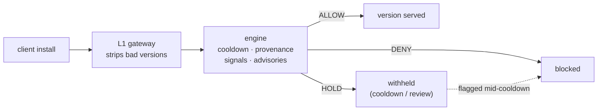

# FAQ

<p align="center">
  
</p>

Common questions about what Embargo is, how to use it, and how it behaves.
For the design see [`ARCHITECTURE.md`](../ARCHITECTURE.md), to run it
[`DEVELOPMENT.md`](../DEVELOPMENT.md), to deploy it
[`DEPLOYMENT.md`](../DEPLOYMENT.md).

## How a request flows



---

## General

**What is Embargo, in one sentence?**
A self-hosted firewall for the npm registry: it *refuses to serve* package
versions until they pass age, provenance, and behavioral-risk checks — it blocks
at install time, rather than warning you after the fact.

**How is this different from a scanner like Snyk / Grype / Trivy?**
Those are SCA/CVE *scanners* — they tell you about known vulnerabilities, usually
after install. Embargo is a *gate*: it changes what your resolver is even allowed
to pick, and it catches *supply-chain* attacks (token-hijacked releases,
malicious republishes, install-time backdoors) that a CVE database doesn't list
yet. They're complementary — pair Embargo with a scanner; it is not a
replacement.

**npm already has `min-release-age` cooldown. Why do I need this?**
Native cooldown is global, has no exception mechanism, and can't act on *why* a
version is suspicious. Embargo adds **per-scope policy**, **fast-track
exceptions** for emergency fixes, and **signal-based gating** that actually
evaluates the version during the wait — plus CI admission control and install
containment. See [the thesis in ARCHITECTURE.md](../ARCHITECTURE.md#thesis).

**Is it a SaaS? Where does my data go?**
No. It's single-org and self-hosted — it runs entirely in your infrastructure.
The only outbound traffic is the engine fetching package metadata from the
upstream registry and advisories from OSV.

---

## Using it (client side)

**How do I point my project at Embargo?**
One line in `.npmrc`:

```ini
registry=https://embargo.your-org.internal/
```

It's protocol-level, so the same line works for **npm, pnpm, Yarn, and Bun** — no
plugins or wrappers on the client.

**Will it break my existing lockfile?**
No. A version already pinned in your lockfile but now *held* produces a clear
Embargo error with the reason and an approval link — never a cryptic `ETARGET`.
Allowed versions resolve exactly as before.

**A version I need is held. What now?**
Open the console: a **responder** can approve it (a logged, time-boxed exception)
or fast-track its scope. For an emergency CVE fix, fast-track is the intended
path. Approvals are audited.

**Why was my install blocked? How do I see the reason?**
Every HOLD/DENY records a reason and the signals that fired. The console's
quarantine/inspector view shows exactly why — which signal, what evidence — for
each version.

---

## Verdicts & policy

**What are the three verdicts?**

| Verdict | Meaning |
|---|---|
| 🟢 **ALLOW** | served normally |
| 🟡 **HOLD** | withheld during cooldown / pending review; re-evaluated when cooldown expires |
| 🔴 **DENY** | blocked permanently; surfaced in the console |

**If a version is held for cooldown and the timer expires, is it just released?**
Only if nothing flagged it. A version flagged by a signal **during** its cooldown
HOLD **escalates to DENY permanently** — it is *not* silently served when the
timer runs out. That escalation is the whole point of the product.

**How does policy resolution work?**
**Most-specific-wins.** You write rules per scope; the most specific matching
rule applies. The default policy, for example, allows `@mycompany/*` immediately
(with provenance required), gives `@types/*` a 6-hour cooldown, holds high-value
packages (`express`, `axios`, `react`, …) for 24 hours with provenance, and
applies a 72-hour catch-all to everything else. See
[`policy/examples/`](../policy/examples/).

**Can I require build provenance for critical packages?**
Yes — `require_provenance: true` on a rule denies versions whose attestation is
absent or unverifiable. This is what catches review-bypass / out-of-pipeline
publishes.

**What's a "fast-track"?**
A per-package allow list on a rule that bypasses the hold — for trusted internal
packages or emergency fixes. Exceptions are logged and (for approvals)
time-boxed.

---

## Signals

**What does Embargo actually look at?**
Age-independent behavioral signals scored during the hold window — new lifecycle
scripts, `binding.gyp` changes, new capability dependencies, republish anomalies,
maintainer changes, tarball/manifest mismatch, obfuscation — plus OSV/advisory
matches. The full catalog and scoring contract is in [`SIGNALS.md`](../SIGNALS.md).

**Why score chains instead of single APIs?**
A single fact is rarely a verdict. "Reads env vars" is benign on its own; "new
dependency **+** reads env **+** new egress host" is an attack. Embargo composes
signals into chains rather than matching one API call — that's what keeps the
false-positive rate down.

**Won't it false-positive constantly?**
False-positive rate is the primary product metric. New/uncertain signals
**HOLD for human review** — they don't silently auto-DENY. When in doubt, it
holds and surfaces the reason rather than guessing.

---

## Operations

**Where do I start deploying?**
[`DEPLOYMENT.md`](../DEPLOYMENT.md). `docker compose up --build` brings up the
full stack; the production checklist there covers real PKI, OIDC, the
fail-closed gate, and managed datastores.

**What happens if the engine goes down?**
It's configurable. The gateway defaults to **fail-open** (serve unfiltered for
availability); set `fail-closed: true` to make it **refuse to serve** without a
verdict. Choose per your risk posture — see
[DEPLOYMENT.md §3](../DEPLOYMENT.md#3-close-the-gate-fail-closed).

**Does it add latency to every install?**
Verdicts are cached in Redis and there are no uncached network calls in the
packument hot path, so steady-state resolve latency is minimal. The first
resolution of a brand-new version does the scoring work.

**How do I enforce the same policy in CI?**
Add the **L2 admission gate** (GitHub Action or CLI) — it fails a build when the
lockfile diff introduces a held/denied version, evaluating only what changed so
CI stays fast. See [`admission/README.md`](../admission/README.md).

**Is the audit log tamper-evident?**
Yes — the audit log is hash-chained and exportable, recording actor, action,
target, and before/after for every change.

---

## Security & scope

**Is this offensive tooling?**
No. Embargo is strictly **defensive** — every part of it detects or blocks
malicious packages. It deliberately contains nothing that would help evade the
gate or exfiltrate data.

**What's explicitly out of scope?**
It's not an SCA/CVE scanner and not a runtime EDR. It is a resolution-time gate
plus install-time containment. Multi-tenancy is out of scope by decision — it's
single-org.

**Found a vulnerability?**
See [`SECURITY.md`](../SECURITY.md).
</content>
